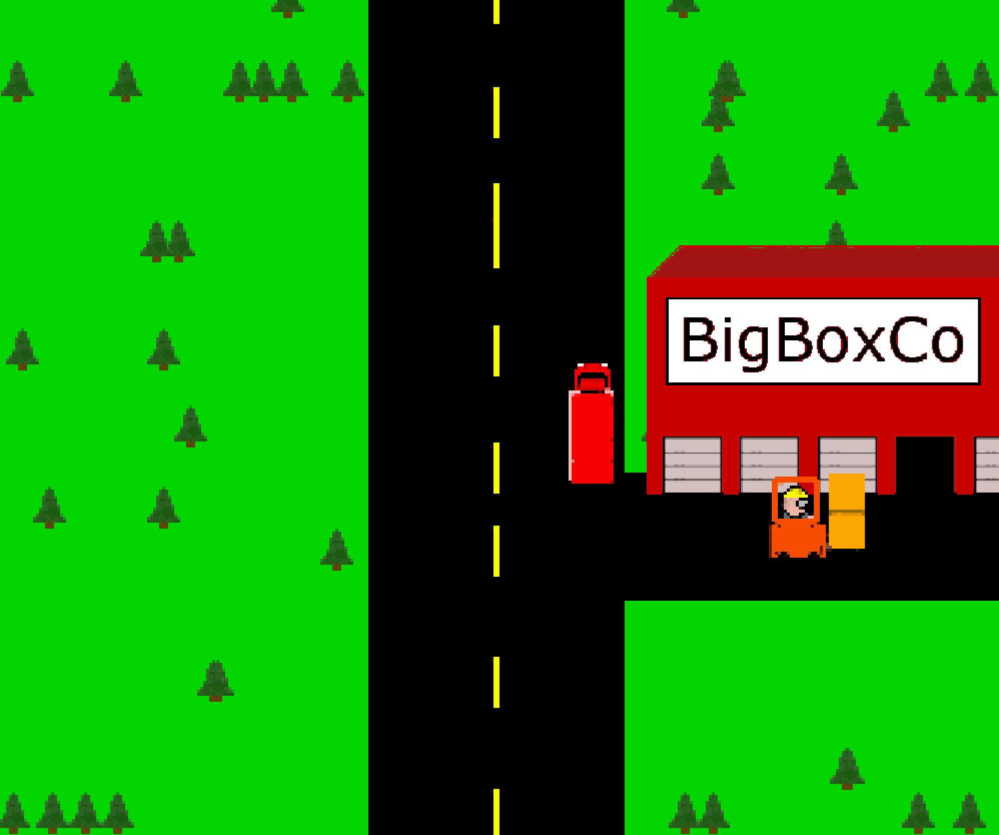

# TruckHunter
A simple semi-truck driving game written in Java 21.  Ok, so I'm playing fast and loose with the word "game."  But still.  It's kinda cool.

## To run:

Run the `truckHunter.jar` JAR file - 

    java -jar truckHunter.jar

### Run Requirements

 - Java 21 (JRE)

## To build:

### Build Requirements

 - Java 21 (JDK)
 - Maven

The [pom.xml](pom.xml) file can be adjusted to build with earlier versions of Java, but it is not recommended to go below 17.

### Build command

    mvn clean install

### Running the build

    java -jar truckhunter-0.0.1-SNAPSHOT-jar-with-dependencies.jar
